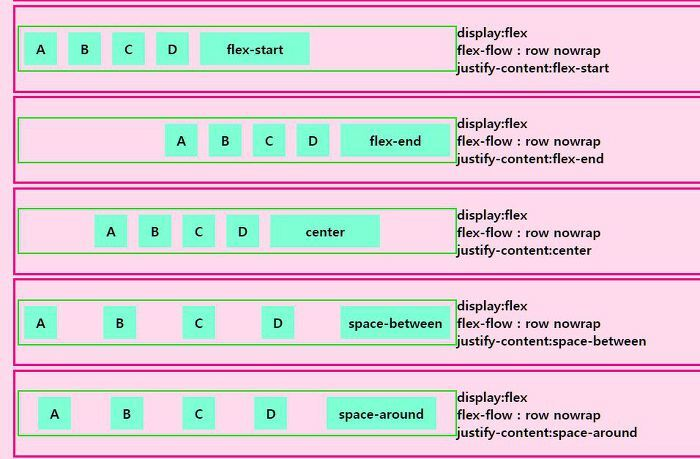
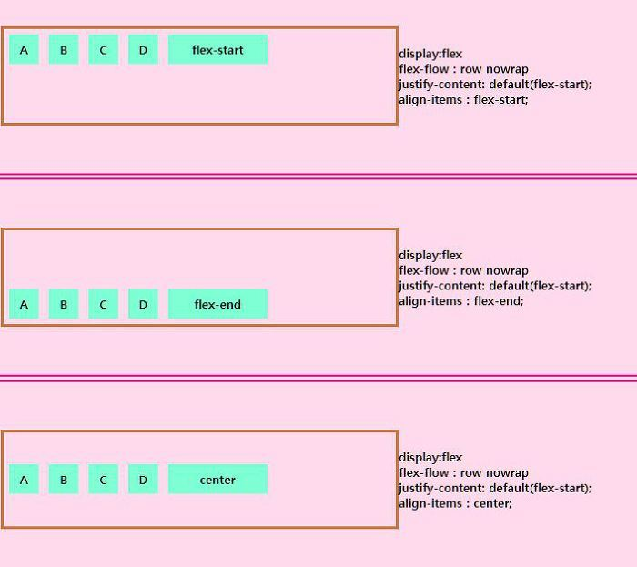

# FlexBox - justify-content, align-items
>Container 속성에서 기존에 있던 direction 속성을 알아야 사용할 수 있는 속성인 justify-content와 align-items 속성

## justify-content ( 가로축 - 중심축 )
- 가로 축을 기준으로 좌우에 대한 정렬을 관장 합니다. 속성 나열은 다음과 같습니다.

---
|속성|설명|
|--|--|
|flex-start(default)|요소들의 컨테이너의 왼쪽으로 정렬|
|flext-end|요소들의 컨테이너의 오른쪽으로 정렬|
|center|요소들의 컨테이너의 중앙으로 정렬|
|space-between|요소들 사이에 동일한 간격을 둡니다|
|space-around|요소들 주위에 동일한 간격을 둡니다|

---

## align-items ( 세로축 - 교차축 )
- 세로 축을 기준으로 정렬을 하게 됩니다. 속성 나열은 다음과 같습니다.

---
|속성|설명|
|--|--|
|flex-start|컨테이너의 최상단으로 정렬 합니다|
|flext-end|컨테이너의 최하단으로 정렬 합니다|
|center|컨테이너의 세로 축의 중앙으로 정렬 합니다|
|baseline|컨테이너의 시작위치에 정렬 합니다|
|stretch(default)|컨테이너의 맞게 늘립니다|

---
